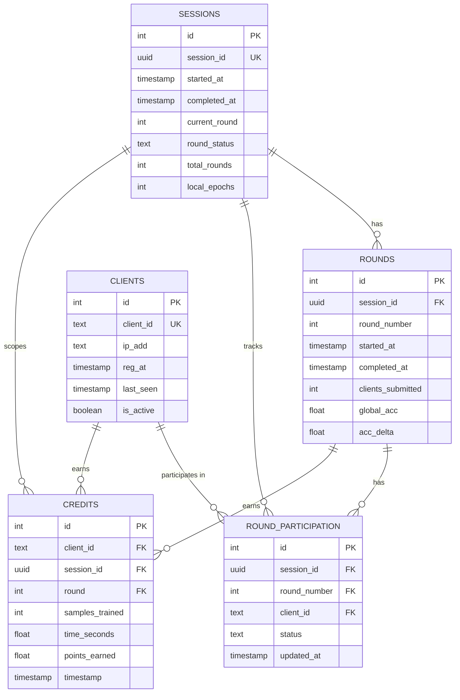

# Net-Neutral-AI — Backend Schema (v3)

One refinement made here that wasn't explicit in the TRD: **`round_number` is unique per session, not globally.** The TRD's original note ("`round_number` must be `UNIQUE`") was written before the `sessions` table existed as a concept — with multiple sessions over time, round 1 of session A and round 1 of session B are both legitimately "round 1." Uniqueness is enforced as the composite `(session_id, round_number)` instead.

---

## ER Diagram



---

## schema.sql

```sql
-- Net-Neutral-AI v3 schema
-- Target: PostgreSQL (Neon in deployment, local Postgres in dev — TRD §6)

CREATE TABLE sessions (
    id              SERIAL PRIMARY KEY,
    session_id      UUID NOT NULL UNIQUE DEFAULT gen_random_uuid(),
    started_at      TIMESTAMPTZ NOT NULL DEFAULT now(),
    completed_at    TIMESTAMPTZ,
    current_round   INT NOT NULL DEFAULT 0,
    round_status    TEXT NOT NULL DEFAULT 'waiting_for_clients'
                        CHECK (round_status IN (
                            'waiting_for_clients',
                            'data_distributing',
                            'training',
                            'aggregating',
                            'active',
                            'completed'
                        )),
    total_rounds    INT NOT NULL,
    local_epochs    INT NOT NULL
);

CREATE TABLE clients (
    id          SERIAL PRIMARY KEY,
    client_id   TEXT NOT NULL UNIQUE,
    ip_add      TEXT,
    reg_at      TIMESTAMPTZ NOT NULL DEFAULT now(),
    last_seen   TIMESTAMPTZ NOT NULL DEFAULT now(),
    is_active   BOOLEAN NOT NULL DEFAULT TRUE
);

CREATE TABLE rounds (
    id                  SERIAL PRIMARY KEY,
    session_id          UUID NOT NULL REFERENCES sessions(session_id) ON DELETE CASCADE,
    round_number         INT NOT NULL,
    started_at          TIMESTAMPTZ NOT NULL DEFAULT now(),
    completed_at        TIMESTAMPTZ,
    clients_submitted   INT NOT NULL DEFAULT 0,
    global_acc          FLOAT,
    acc_delta           FLOAT,
    UNIQUE (session_id, round_number)
);

-- Per-round, per-client status. This is what powers disconnect handling
-- (TRD §4.5 / PRD §5.6): a client can be 'registered' -> 'submitted', or
-- age out to 'missed' (round timeout, may still rejoin later) or
-- 'disconnected' (longer absence -> triggers hard-delete of transient
-- artifacts, but this row itself is retained as participation history).
CREATE TABLE round_participation (
    id              SERIAL PRIMARY KEY,
    session_id      UUID NOT NULL REFERENCES sessions(session_id) ON DELETE CASCADE,
    round_number    INT NOT NULL,
    client_id       TEXT NOT NULL REFERENCES clients(client_id) ON DELETE CASCADE,
    status          TEXT NOT NULL DEFAULT 'registered'
                        CHECK (status IN ('registered', 'submitted', 'missed', 'disconnected')),
    updated_at      TIMESTAMPTZ NOT NULL DEFAULT now(),
    UNIQUE (session_id, round_number, client_id),
    FOREIGN KEY (session_id, round_number) REFERENCES rounds(session_id, round_number) ON DELETE CASCADE
);

CREATE TABLE credits (
    id              SERIAL PRIMARY KEY,
    client_id       TEXT NOT NULL REFERENCES clients(client_id) ON DELETE CASCADE,
    session_id      UUID NOT NULL REFERENCES sessions(session_id) ON DELETE CASCADE,
    round           INT NOT NULL,
    samples_trained INT NOT NULL,
    time_seconds    FLOAT NOT NULL,
    points_earned   FLOAT NOT NULL,
    timestamp       TIMESTAMPTZ NOT NULL DEFAULT now(),
    FOREIGN KEY (session_id, round) REFERENCES rounds(session_id, round_number) ON DELETE CASCADE
);

-- Indexes for the lookups the coordinator will actually run on every request
CREATE INDEX idx_round_participation_session_round ON round_participation(session_id, round_number);
CREATE INDEX idx_credits_client ON credits(client_id);
CREATE INDEX idx_clients_last_seen ON clients(last_seen);
```
